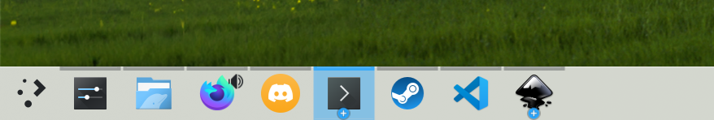

# PowerBreeze

PowerBreeze is just the KDE Plasma Breeze theme with some tweaks.

Currently there is only one tweak: Removing the background from minimized/inactive apps and removing the difference between minimized/inactive apps.

Install the theme in `$HOME/.local/share/plasma/desktoptheme/` and enable it in the Plasma Style settings!